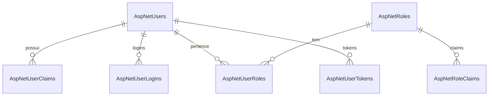

# 🧩 ASP.NET Core Identity – Estrutura de Banco de Dados (PostgreSQL / Supabase)

> Documentação detalhada das tabelas criadas para o sistema de autenticação e autorização do ASP.NET Core Identity.  
> Este modelo segue a convenção padrão do `IdentityUser<string>` usada no Blazor Server e ASP.NET Core 8, adaptado para PostgreSQL (Supabase).

---

## 📘 Visão Geral

O **ASP.NET Identity** gerencia autenticação (login), autorização (roles e claims) e segurança de usuários em aplicações .NET.

O esquema criado contém **7 tabelas principais**, todas no schema `public`:

| Tabela | Finalidade principal |
|--------|----------------------|
| `AspNetUsers` | Armazena informações de usuários |
| `AspNetRoles` | Armazena papéis (grupos de permissão) |
| `AspNetUserRoles` | Faz a relação entre usuários e papéis |
| `AspNetUserClaims` | Guarda declarações personalizadas de usuários |
| `AspNetRoleClaims` | Declarações associadas aos papéis |
| `AspNetUserLogins` | Armazena logins externos (Google, Microsoft, etc.) |
| `AspNetUserTokens` | Tokens persistentes (lembrar login, reset de senha, etc.) |

---

## 🧱 1. Tabela `AspNetUsers`
Contém os **dados de perfil, autenticação e segurança** de cada usuário.

### 🔹 Função:
É a tabela **central** do Identity. Todos os relacionamentos (claims, roles, tokens, logins) referenciam usuários a partir de seu `Id`.

### 🔹 Colunas:
| Coluna | Tipo | Descrição |
|--------|------|------------|
| `Id` | `varchar(450)` | Identificador único do usuário (GUID ou string). **PK** |
| `UserName` | `varchar(256)` | Nome de usuário definido no cadastro. |
| `NormalizedUserName` | `varchar(256)` | Versão em maiúsculas do `UserName` (usada para buscas). |
| `Email` | `varchar(256)` | Endereço de e-mail do usuário. |
| `NormalizedEmail` | `varchar(256)` | Versão normalizada do e-mail (para comparação sem case-sensitive). |
| `EmailConfirmed` | `boolean` | Indica se o e-mail foi confirmado. |
| `PasswordHash` | `text` | Hash da senha (armazenada em formato Identity PBKDF2). |
| `SecurityStamp` | `text` | Valor aleatório para invalidar tokens antigos. |
| `ConcurrencyStamp` | `text` | Controla concorrência (atualizações simultâneas). |
| `PhoneNumber` | `text` | Número de telefone (opcional). |
| `PhoneNumberConfirmed` | `boolean` | Indica se o telefone foi validado. |
| `TwoFactorEnabled` | `boolean` | Indica se o 2FA está habilitado. |
| `LockoutEnd` | `timestamp with time zone` | Data em que expira o bloqueio do usuário. |
| `LockoutEnabled` | `boolean` | Indica se o bloqueio de login pode ocorrer. |
| `AccessFailedCount` | `integer` | Contagem de tentativas de login malsucedidas. |

### 🔹 Índices:
- **UserNameIndex:** garante unicidade do `NormalizedUserName`.
- **EmailIndex:** acelera buscas por e-mail.

---

## 🧱 2. Tabela `AspNetRoles`
Guarda **papéis (roles)** — grupos de permissão como `"Administrator"`, `"User"`, `"Manager"`, etc.

### 🔹 Colunas:
| Coluna | Tipo | Descrição |
|--------|------|------------|
| `Id` | `varchar(450)` | Identificador único do papel. **PK** |
| `Name` | `varchar(256)` | Nome do papel (ex.: `Administrator`). |
| `NormalizedName` | `varchar(256)` | Nome normalizado (maiúsculo). |
| `ConcurrencyStamp` | `text` | Controle de versão de concorrência. |

### 🔹 Índices:
- **RoleNameIndex:** garante que `NormalizedName` seja único.

---

## 🧱 3. Tabela `AspNetUserRoles`
Faz a **relação N:N** entre `AspNetUsers` e `AspNetRoles`.

Um usuário pode pertencer a vários papéis, e um papel pode ter vários usuários.

### 🔹 Colunas:
| Coluna | Tipo | Chave | Descrição |
|--------|------|-------|------------|
| `UserId` | `varchar(450)` | **FK** → `AspNetUsers(Id)` | Usuário associado |
| `RoleId` | `varchar(450)` | **FK** → `AspNetRoles(Id)` | Papel associado |

### 🔹 Chaves:
- **PK:** composta por (`UserId`, `RoleId`)
- **FK:**  
  - `FK_AspNetUserRoles_AspNetUsers_UserId`  
  - `FK_AspNetUserRoles_AspNetRoles_RoleId`  
  *(ambas com `ON DELETE CASCADE`)*

### 🔹 Exemplo de uso:
| UserId | RoleId |
|--------|--------|
| `a1b2...` | `r-admin` |

---

## 🧱 4. Tabela `AspNetUserClaims`
Armazena **claims personalizadas** (declarações extras) associadas a um usuário individual.

### 🔹 Colunas:
| Coluna | Tipo | Chave | Descrição |
|--------|------|-------|------------|
| `Id` | `serial` | **PK** | Identificador da claim |
| `UserId` | `varchar(450)` | **FK** → `AspNetUsers(Id)` | Usuário dono da claim |
| `ClaimType` | `text` |  | Tipo da claim (ex.: `role`, `permission`, `department`) |
| `ClaimValue` | `text` |  | Valor da claim |

### 🔹 Exemplo:
| ClaimType | ClaimValue |
|------------|------------|
| `department` | `Finance` |

---

## 🧱 5. Tabela `AspNetRoleClaims`
Guarda **claims ligadas a papéis** (e não a usuários específicos).  
Essas claims são herdadas automaticamente por todos os usuários daquele papel.

### 🔹 Colunas:
| Coluna | Tipo | Chave | Descrição |
|--------|------|-------|------------|
| `Id` | `serial` | **PK** | Identificador da claim |
| `RoleId` | `varchar(450)` | **FK** → `AspNetRoles(Id)` | Papel associado |
| `ClaimType` | `text` |  | Tipo da claim |
| `ClaimValue` | `text` |  | Valor da claim |

---

## 🧱 6. Tabela `AspNetUserLogins`
Registra os logins de **provedores externos** (Google, Microsoft, GitHub, etc.) vinculados a usuários.

### 🔹 Colunas:
| Coluna | Tipo | Chave | Descrição |
|--------|------|-------|------------|
| `LoginProvider` | `varchar(128)` | Parte da **PK** | Nome do provedor (`Google`, `Microsoft`, etc.) |
| `ProviderKey` | `varchar(128)` | Parte da **PK** | ID único do usuário no provedor externo |
| `ProviderDisplayName` | `text` |  | Nome descritivo do provedor |
| `UserId` | `varchar(450)` | **FK** → `AspNetUsers(Id)` | Usuário vinculado |

### 🔹 PK composta:
(`LoginProvider`, `ProviderKey`)

---

## 🧱 7. Tabela `AspNetUserTokens`
Armazena **tokens persistentes** do usuário (para autenticação, redefinição de senha, 2FA, etc.).

### 🔹 Colunas:
| Coluna | Tipo | Chave | Descrição |
|--------|------|-------|------------|
| `UserId` | `varchar(450)` | **FK** → `AspNetUsers(Id)` | Usuário associado |
| `LoginProvider` | `varchar(128)` | Parte da **PK** | Origem do token |
| `Name` | `varchar(128)` | Parte da **PK** | Tipo de token (`RefreshToken`, `PasswordReset`, etc.) |
| `Value` | `text` |  | Valor criptografado do token |

### 🔹 PK composta:
(`UserId`, `LoginProvider`, `Name`)

---

## 🔗 Resumo dos Relacionamentos

---

## 🧠 Boas práticas

Não altere nomes das tabelas padrão — o Identity depende deles.

Campos NormalizedName e NormalizedUserName devem sempre ser maiúsculos.

Use ON DELETE CASCADE (já incluso) para evitar órfãos ao deletar usuários.

Caso adicione colunas extras em ApplicationUser, mantenha o tipo e tamanho coerentes (varchar, text, boolean, etc.).

---

## 📄 Referências

[**Documentação oficial do ASP.NET Core Identity**](https://learn.microsoft.com/pt-pt/aspnet/core/security/authentication/identity?view=aspnetcore-9.0) 

[**Npgsql Provider Docs**](https://www.npgsql.org/efcore/?tabs=onconfiguring) 

[**Autor: Leonardo Dalmazzo**](https://leonardodalmazzo.github.io/Leonardo-Dalmazzo/) 
Banco: Supabase (PostgreSQL 14)
Framework: ASP.NET Core 8 / Blazor Server